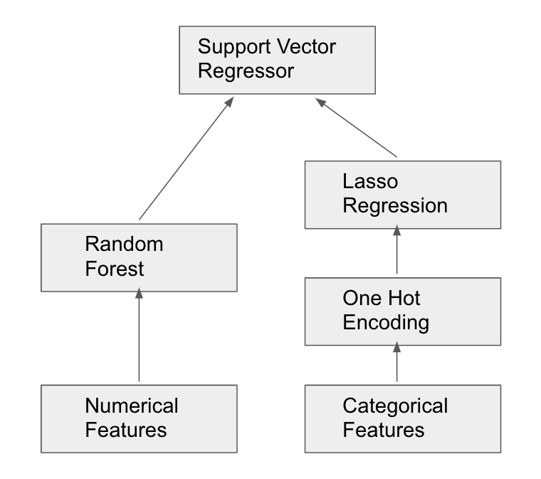

# mlforest

Stacking is a powerful machine learning technique, but handling an excessive amount of models can be painful. For example, after training the stacking models as below:

If we want to change only some parameters in `lasso`, then only `lasso` and `svr` need to be retrained. However, to reuse the other models/transformations and their output, we need to manually save them. 

**What if a package can save and index every model that we have trained? What if a package can automatically search the old models we trained and fetch them whenever we need them back?**

Check out the demo code of `mlforest` right now!

A simple example of a usage of the package. First create a virtual environment with `virtualenv` called `demo_mlforest`. Then:
- `cd demo_mlforest/`
- `source bin/activate`
- `git clone https://github.com/LukeLinEx/mlforest.git`
- `cd mlforest`
- `pip install -e .`
- `jupyter notebook`
